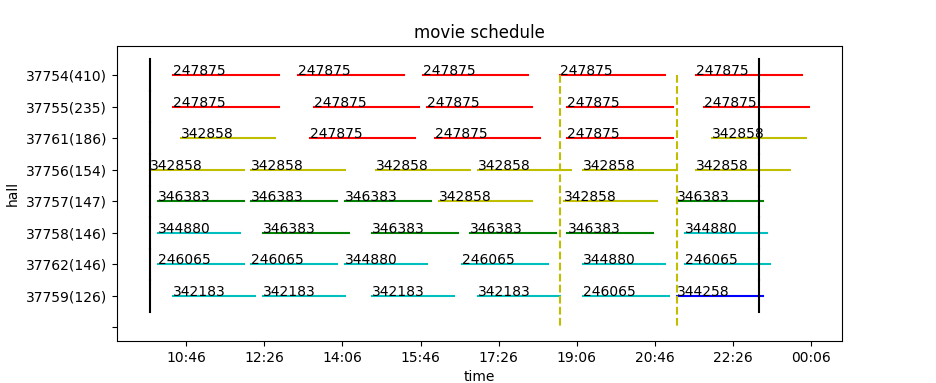

# movie-schedule
movie schedule by genetic algorithm

- movie.py implemented by [pyrimidine](https://pyrimidine.readthedocs.io/)
- movie_vcga.py implemented by vcga
- movie_problem.py implemented by deap

- pyrimidine: fitness = (13.0202, 3.3795, 2306.5563, 8)
- movie_problem: fitness = (18.1928, 4.4589, 1947.8639, 8)
- movie_vcga: fitness = (20, 4.9028, 1918.5498, 8)
